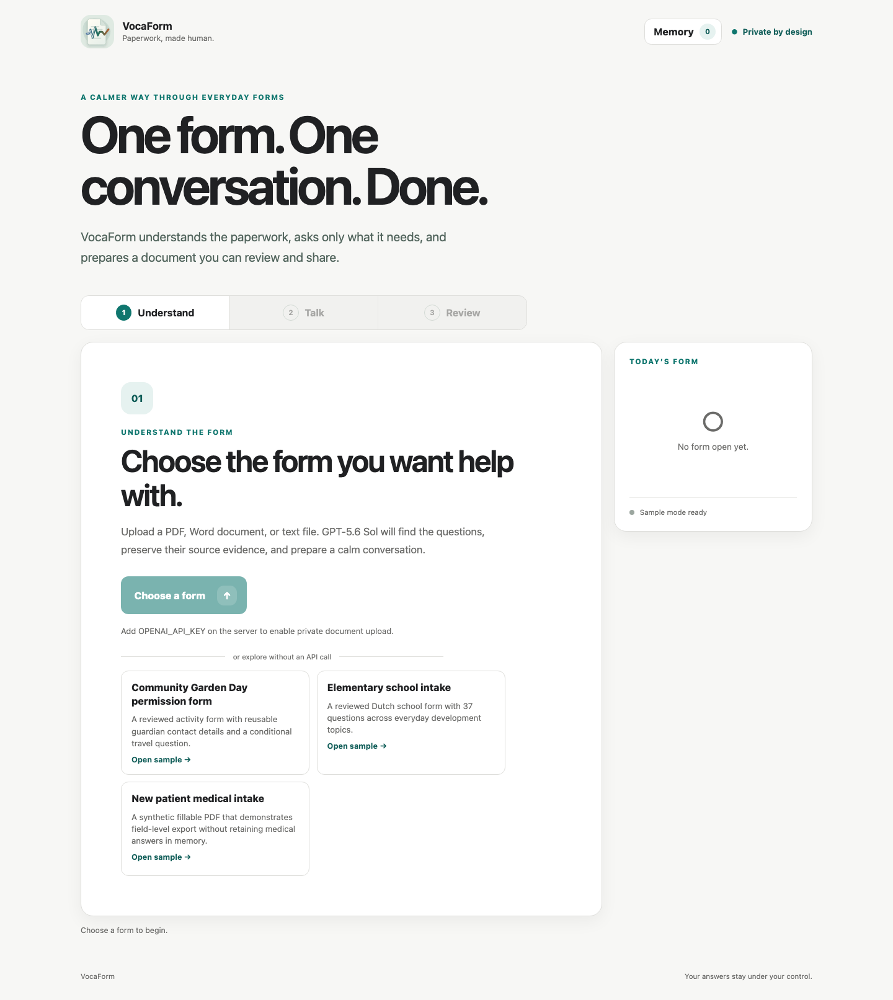

# VocaForm

> **One form. One conversation. Done.**

VocaForm turns everyday paperwork into a calm, accessible conversation. Upload a PDF, Word document, or text form; answer only the questions it needs; review what was understood; and download a completed document. Reusable contact details are remembered only after explicit consent.

**Built for [OpenAI Build Week](https://openai.devpost.com/) · Apps for Your Life**

[Build Week roadmap](./BUILD_WEEK_ROADMAP.md) · [Submission evidence](./SUBMISSION_EVIDENCE.md) · [Resilience report](./RESILIENCE_REPORT.md) · [Three-minute demo plan](./DEMO_VIDEO_PLAN.md)

<p align="center">
  
</p>

## The problem

Paperwork assumes that everyone can comfortably read dense administrative language, type repeated details, understand conditional questions, and check a document for omissions. That creates avoidable friction for people with disabilities, low digital confidence, language barriers, limited time, or simply too many forms to complete.

A generic chatbot is not enough. A useful form assistant must stay grounded in the source, preserve exact answers, make uncertainty visible, require consent before reusing personal information, and return a real document—not just a transcript.

## What VocaForm does

1. **Upload** — Accepts PDF, DOCX, TXT, and Markdown forms, with three reviewed synthetic samples available offline.
2. **Understand** — GPT-5.6 Sol compiles an unfamiliar form into a strict, evidence-backed schema containing fields, requiredness, dependencies, source evidence, and render targets.
3. **Talk** — OpenAI Realtime conducts a natural speech-to-speech interview. Versioned application tools save validated answers as the conversation happens; a keyboard-accessible text path provides the same core journey.
4. **Review** — Deterministic checks find missing or invalid answers, then a separate non-mutating GPT-5.6 Sol pass can flag contradictions, ambiguity, and unsupported normalization.
5. **Download** — VocaForm fills copied DOCX and AcroForm PDF sources when safe, or produces a clearly identified, section-matched DOCX answer packet.
6. **Reuse—only by choice** — Eligible contact facts can be remembered, corrected, forgotten, and individually confirmed on a later form. Medical and other sensitive answers are excluded by default.

The result is one coherent **Upload → Talk → Review → Download** product journey rather than a collection of model demos.

### Language posture

VocaForm has an English application interface and language-aware form handling. Form locales are validated and canonicalized as BCP 47 tags; form-derived titles, prompts, examples, labels, and source excerpts retain that language boundary for assistive technology, and right-to-left content receives automatic text direction. Realtime defaults to the form language and supplies a two-letter transcription hint only when the locale has a valid ISO-639-1 language subtag.

The reviewed submission journeys cover English (`en-US`) and Dutch (`nl-NL`) form content. Other form languages are architecture-level, best-effort support rather than a QA-certified claim. The interface, generated fallback-document chrome, and application-owned status text remain English, and a translated UI, language selector, and full right-to-left journey are follow-up work.

## The trust model

Models can understand, converse, and advise; application code remains authoritative.

| Layer | Responsibility | What it cannot do silently |
| --- | --- | --- |
| GPT-5.6 Sol | Compile unfamiliar forms and perform final semantic review | Write answers, approve memory, or unlock export |
| OpenAI Realtime | Conduct the low-latency voice interview and request tool calls | Bypass field, value, provenance, or session-version validation |
| TypeScript domain layer | Own answers, dependencies, consent, memory eligibility, verification, and export gates | Accept invalid or stale writes |
| Document adapters | Fill copied DOCX/PDF sources and report exact placement coverage | Mutate the uploaded source or hide a fallback |

Every accepted answer retains provenance from the document, conversation, confirmed memory, or an explicit user correction. Any change invalidates the previous semantic pass, and verified export is tied to the exact current session version.

## How GPT-5.6 is used

GPT-5.6 Sol is reserved for the two tasks where document-level reasoning matters most:

- **Form compilation:** it receives the source document—plus a high-detail visual companion for layout-sensitive formats—and returns strict Structured Outputs with source evidence and rendering targets.
- **Final verification:** it receives the typed form and answer state, reports only structured semantic findings, uses `store: false`, and cannot mutate the session.

Realtime handles conversation because latency matters there. Deterministic application logic owns state, consent, validation, memory, and rendering because user control matters there. A live evaluation found no correctness gain from Pro verification mode on the synthetic semantic cases, so the faster, lower-token standard/high configuration remains the default.

## How Codex accelerated the build

Codex with GPT-5.6 was the development collaborator, not an application runtime dependency. It accelerated:

- the rebuild from a local JavaScript prototype into a modular React and TypeScript application;
- canonical Zod contracts and provider-independent session behavior;
- parity adapters around proven DOCX and form-state code;
- fixture-driven compiler, verifier, renderer, accessibility, and resilience evaluations;
- recovery handling for interruption, retries, duplicate tool calls, and reconnects;
- the accessibility-led UI, Playwright journeys, and visual-regression suite.

Human decisions defined the product boundaries: models do not own state, memory is opt-in and application-owned, sensitive answers are excluded by default, verification is non-mutating, fallbacks are explicit, and unsupported production-healthcare claims remain out of scope. The full decision trail and measurable exit criteria are recorded in [BUILD_WEEK_ROADMAP.md](./BUILD_WEEK_ROADMAP.md).

## Prior work vs. Build Week work

VocaForm existed as a proven local Node.js prototype before OpenAI Build Week. The dated pre-event baseline is commit [`cd2b782`](https://github.com/Timverhoogt/VocaForm/commit/cd2b782). Its legacy server, browser UI, importers, Realtime connection, form state, and DOCX primitives remain in `src/` and `public/` so their behavior can be tested during replacement.

The Build Week range is [`ca05d21..HEAD`](https://github.com/Timverhoogt/VocaForm/compare/ca05d21...codex/build-week-rebuild) on `codex/build-week-rebuild`. The new `app/` tree, TypeScript domain and API, GPT-5.6 compiler and verifier, validated Realtime tools, consent-based Memory Vault, PDF/DOCX renderers, accessible product journey, golden evaluations, and resilience instrumentation were built during the event. The preserved prototype is not presented as new Build Week work; it is wrapped behind tested adapters until equivalent behavior is proven.

The repository history is intentionally preserved so judges can inspect the pre-event baseline and the Build Week changes independently.

## Judge quick start

### Requirements

- Node.js 20 or newer
- npm
- Chromium only for the optional browser test suite
- LibreOffice only when visually compiling arbitrary DOCX uploads; set `SOFFICE_BIN` if `soffice` is not on `PATH`

### Run the reviewed samples without an API key

```bash
git clone https://github.com/Timverhoogt/VocaForm.git
cd VocaForm
npm install
npm run dev
```

Open [http://127.0.0.1:5173](http://127.0.0.1:5173). The client proxies API calls to `http://127.0.0.1:5177`.

No key is required to open the reviewed synthetic forms, use the text interview, exercise deterministic validation and memory consent, or download a marked draft. A useful offline test path is:

1. Open **Community Garden Day permission form**.
2. Answer the guardian name, phone, and email fields through the text path.
3. In Review or Memory, explicitly choose **Remember** for those contact facts.
4. Close the form and open **Elementary school intake**.
5. Confirm each Memory Vault suggestion; no value is applied before confirmation.
6. Correct or forget a claim from **Memory**, then verify it is not silently reused.

Without an API key, upload compilation, voice, and the final Sol semantic pass are explicitly unavailable; the deterministic and draft paths remain usable.

### Run the complete AI journey

Copy the environment template and add a server-side OpenAI API key:

```bash
cp .env.example .env
```

```dotenv
OPENAI_API_KEY=your-key-here
```

The checked-in defaults select `gpt-5.6-sol` for compilation and verification and `gpt-realtime-2.1` for conversation. All model and server overrides are documented in [.env.example](./.env.example).

Generate the reviewed medical PDF and school DOCX sources:

```bash
npm run fixtures:rendering
```

Then upload `work/golden/medical-intake.pdf` to exercise the north-star journey: source-grounded compilation, live voice answers, deterministic and semantic review, and native AcroForm export. The generated files and all local runtime state remain under ignored `work/` storage.

To build and serve the production bundle:

```bash
npm run build
npm start
```

Open [http://127.0.0.1:5177](http://127.0.0.1:5177).

### Deploy the synthetic judge preview

The repository includes a Docker image and a frozen Render Blueprint in [`render.yaml`](./render.yaml). The container installs LibreOffice for layout-sensitive DOCX compilation, runs as an unprivileged user, binds to `0.0.0.0`, and exposes `/api/health`. Import the Blueprint, provide `OPENAI_API_KEY` through the Render dashboard prompt, and deploy the exact release-candidate commit. The secret is never stored in the Blueprint.

`VOCAFORM_PUBLIC_DEMO=true` adds a visible synthetic-data warning and isolates each browser in an opaque, HTTP-only demo session. Active forms, retained source bytes, verification state, and Memory Vault changes are not visible to other visitors and are never written to demo storage. Public sessions are bounded to 100 active visitors, expire after at most two hours, and may disappear on a server restart. Expensive anonymous model routes are rate-limited per visitor and network address (compilation 3/hour; verification and Realtime 10/hour). The free Render instance also uses an ephemeral filesystem and can cold-start after idling; this remains a judge preview, not production or private-data storage. Full deployment and signed-out QA steps are in [SUBMISSION_CHECKLIST.md](./SUBMISSION_CHECKLIST.md).

## Evidence, not just a happy path

The repository contains synthetic golden forms, answer keys, deterministic evaluations, and end-to-end accessibility journeys. The current release evidence is recorded in [RESILIENCE_REPORT.md](./RESILIENCE_REPORT.md).

| Check | Recorded result |
| --- | --- |
| Golden compiler baseline | 53/53 fields, 25/25 required fields, zero fabrication, no missing dependencies |
| Live GPT-5.6 Sol replay, July 15 | 53/53 fields, 25/25 required fields, zero fabrication, no missing dependencies |
| Final-verifier fixtures | 100% of five seeded blocker classes detected and gated |
| Native renderer coverage | 45/45 demo answers placed; original sources preserved |
| Repeated north-star resilience | 5/5 isolated passes with duplicate-call suppression and reconnect recovery |
| Safe memory journey | Exactly three approved contact claims reused; zero sensitive claims stored |
| Unit and adapter tests | 72/72 across 18 Vitest files |
| Desktop/mobile browser suite | 16/16 Playwright journeys and visual checks |

These are results on reviewed synthetic fixtures, not claims of clinical accuracy or universal form support. The current live `gpt-5.6-sol` replay is recorded separately from the deterministic approved-output score in [SUBMISSION_EVIDENCE.md](./SUBMISSION_EVIDENCE.md) and its privacy-safe JSON evidence file. The earlier two-pass run on the then-current 52-field set remains historical evidence rather than being combined with the current result.

Run the complete deterministic quality gate:

```bash
npm run check
```

For the submission-grade gate, including the production build and desktop/mobile Playwright suite:

```bash
npx playwright install chromium
npm run check:resilience
```

For the final pre-submission gate, including the release-document, deployment, licensing, prior-work, and live-evidence audit:

```bash
npm run check:submission
```

Useful focused commands:

```bash
npm run typecheck
npm run lint
npm run test
npm run eval:compiler
npm run eval:verifier
npm run eval:renderer
npm run eval:resilience
npm run test:accessibility
npm run test:visual
```

The deterministic evaluations do not spend API credits. Live compiler and verifier replays are separate commands so an offline approved output cannot be mistaken for a live-model score.

## Architecture

```text
app/client/     Accessible React/Vite product experience
app/domain/     Provider-independent TypeScript and Zod contracts
app/adapters/   Proven-code adapters and DOCX/PDF renderers
app/server/     TypeScript HTTP API and server-only OpenAI configuration
app/shared/     Serialized client/server contracts
app/evals/      Golden compiler, verifier, renderer, and resilience fixtures
app/e2e/        Keyboard, accessibility, memory, verification, and visual journeys
src/            Preserved pre-event prototype and document primitives
public/         Preserved legacy UI and shared brand assets
data/           Reviewed synthetic schemas, profiles, and golden sources
work/           Ignored local uploads, generated fixtures, memory, and traces
```

The domain layer imports no browser, server, or provider code. Provider responses are translated into canonical schemas before application state can change.

## Supported documents and outputs

| Source | Understanding | Completed output |
| --- | --- | --- |
| Fillable PDF | Text, high-detail page imagery, and exact AcroForm inventory | Answers placed into named fields in a copied PDF |
| DOCX | Extracted structure plus a visual PDF companion when LibreOffice is available | Answers placed at matched anchors in a copied DOCX |
| TXT / Markdown | Source text and explicit field evidence | Section-matched DOCX answer packet |
| Non-writable or unmatched source | Same evidence-backed interview schema | Explicit answer packet or per-field fallback; never silent omission |

Scanned, non-AcroForm PDFs currently receive an answer packet rather than a pixel-perfect page overlay.

## Privacy and accessibility

- API keys remain on the server; the browser receives only boolean readiness.
- Uploaded bytes and active sessions stay in process memory and are discarded when cleared or when the server exits.
- In public-demo mode, a secure same-site browser cookie selects an isolated, expiring in-memory visitor state; public Memory Vault changes are not persisted.
- Public compilation, final-verification, and Realtime routes have per-visitor and per-address request budgets with explicit `429` recovery guidance.
- Compiler and verifier Responses API calls use `store: false`.
- Rendering works from copied bytes and verifies that the retained source is unchanged.
- The local Memory Vault stores only explicitly approved eligible claims, uses user-only file permissions, and supports visible correction and deletion.
- Medical, financial, identity-document, child-identity, consent, support, and long free-form answers are excluded from memory by default.
- Privacy-safe traces accept timings, outcomes, token counts, known tool names, cache state, and render coverage—but no filenames, IDs, answers, transcripts, prompts, or error messages.
- The full journey has semantic landmarks, managed focus, live status and error announcements, keyboard operation, an equal text path, 44 CSS-pixel targets, 200% text reflow, reduced-motion support, forced-color support, and WCAG AA color contrast.

This Build Week local store is not encrypted, and VocaForm is not represented as production medical software or as satisfying any healthcare compliance regime. Only synthetic data is committed.

## Current limitations

- Active sessions are process-local. Realtime reconnects survive a browser transport interruption, not an API server restart.
- Low-confidence compilation blockers require a clearer source; field-level editing of a compiled schema is deferred.
- Pixel-perfect overlays for arbitrary scanned PDFs are out of scope.
- The mandatory Sol semantic pass on verified export is provisional pending user testing; deterministic validation remains mandatory.
- The local Memory Vault is a Build Week demonstration store, not a production store for sensitive personal data.
- The UI and generated fallback-document chrome are English; English and Dutch form content are reviewed, while other languages and right-to-left journeys are not submission-QA certified.
- Export accessibility is source-dependent. VocaForm adds document language and PDF field labels where safe, and its answer packets use real headings and linear reading order, but it does not remediate arbitrary sources into tagged PDF or claim PDF/UA conformance.

## Project documentation

- [BUILD_WEEK_ROADMAP.md](./BUILD_WEEK_ROADMAP.md) — architecture decisions, scope cuts, acceptance criteria, and submission plan
- [SUBMISSION_EVIDENCE.md](./SUBMISSION_EVIDENCE.md) — live Sol replay and deterministic release evidence
- [SUBMISSION_CHECKLIST.md](./SUBMISSION_CHECKLIST.md) — deployment, video, signed-out QA, and Devpost handoff
- [PRE_SUBMISSION_REVIEW.md](./PRE_SUBMISSION_REVIEW.md) — UI/UX, locale, low-vision, screen-reader, and output-accessibility gate
- [EXPORT_ACCESSIBILITY_REVIEW.md](./EXPORT_ACCESSIBILITY_REVIEW.md) — reviewed PDF/DOCX structure, rendered evidence, and the source-dependent export claim
- [DEVPOST_SUBMISSION.md](./DEVPOST_SUBMISSION.md) — copy-ready submission fields and project narrative
- [RESILIENCE_REPORT.md](./RESILIENCE_REPORT.md) — five-pass release evidence, diagnostic contract, and recovery audit
- [DEMO_VIDEO_PLAN.md](./DEMO_VIDEO_PLAN.md) — under-three-minute narrated demo storyboard and submission QA
- [IMPORT_MATRIX.md](./IMPORT_MATRIX.md) — document-format support and known limitations
- [data/golden/README.md](./data/golden/README.md) — synthetic fixtures, answer keys, and evaluation boundaries

## License

[MIT](./LICENSE) © 2026 VocaForm contributors
